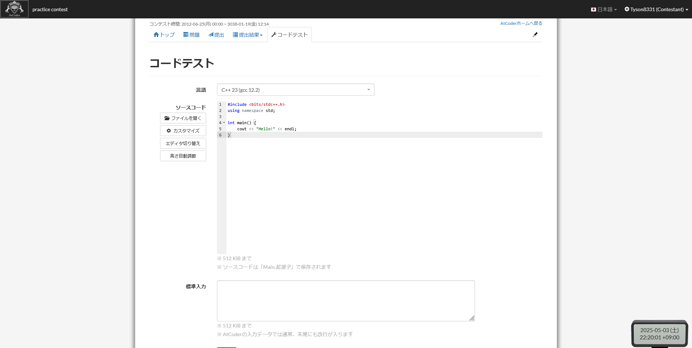

# 第1章-コードの実行

前回の講座ではプログラミングとは何かについて解説しましたが、解説だけでは飽きると思うのでここでは皆さんに実際にコードを実行してプログラミングの楽しさを体験してもらおうと思います。

プログラミングを体験する前に [AtCoder](https://atcoder.jp){:target="_blank"} に登録をしてください。  
<!-- TODO: 登録の仕方 -->
これから問題演習をしたりプログラミングを学ぶ上でAtCoderは避けて通れないと思うので登録しておいたほうがいいです。
AtCoderとは何かについては競技プログラミングとは何かの章でお話します。

登録ができたらAtCoderの [コードテスト](https://atcoder.jp/contests/practice/custom_test){:target="_blank"} を開いてください。

開けると以下のような画面が出てくるはずです。



そうしたら「言語」というところから **C++23 (gcc 12.2)** (画像と同じもの)を選択してください。  
それが出来たら下のコードをコピーして **ソースコード** の部分に張り付けてください。  
今はコードの意味が分からなくても大丈夫です。後で分かるようになるので。

```cpp
#include <bits/stdc++.h>
using namespace std;

int main() {
    cout << "Hello!" << endl;
}
```

貼り付け終わったら画面を下にスクロールして、青い **実行** ボタンを押してください。  
しばらく待つと **標準出力** という部分に `Hello!` と表示されると思います。  
されていない場合はどこか間違えているのでもういちどコピペをしてみてください。

標準出力に `Hello!` と表示された方、おめでとうございます！プログラムを実行することができました！  
とても簡単ですよね？

## (補足) コードテスト以外の実行環境

実行環境とは、簡単にソフトやらプログラムなりを動かすために必要な物が揃った『場』のことです。
コードテストも良い環境ですが、より異なった特徴や機能を持ったものがあるため、紹介します。

### [1. Wandbox](https://wandbox.org/){:target="_blank"}

コンパイル時のオプションなどを変更でき、シンプルなUIで使いやすいです。  
コードの共有などもしやすいです。

### [2. paiza](https://paiza.io/ja/projects/new?language=cpp){:target="_blank"}

登録なしで使うことができます。

### [3. Visual Studio Code](https://code.visualstudio.com){:target="_blank"} (PC専用)

これまでのものは全てオンラインで使用するWebサービスでしたが、これは「コードエディタ」と呼ばれるもので、コンパイラなどは自前でセットアップする必要があります。  
Visual Studio Code・コンパイラ(g++)のセットアップについては以下の動画がわかりやすいので、参考にしてください。（ただ、一人でやるのは難しいと思うので、分からなければ質問してください。）  
<https://www.youtube.com/watch?v=uhnASau7fB4>{:target="_blank"}

## 次回の予定

今回は皆さんに AtCoder のコードテストの使い方を知り、使ってもらいました。  
これでプログラミングをする準備は整いました。次回からは皆さんにコードを書いてもらいます。
